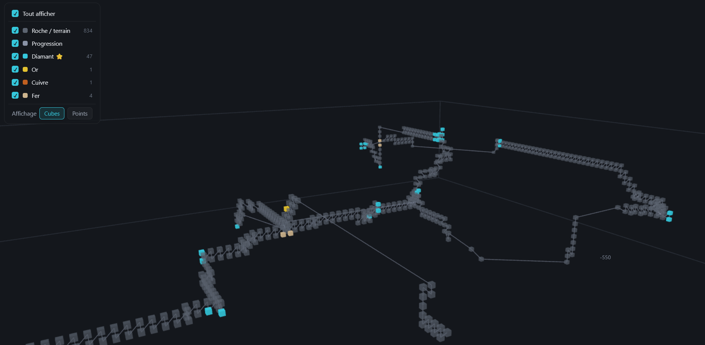
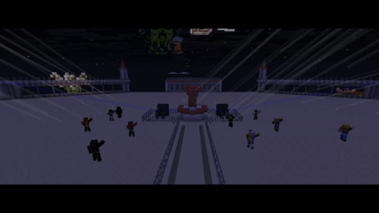
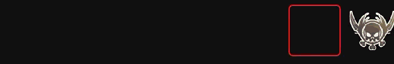
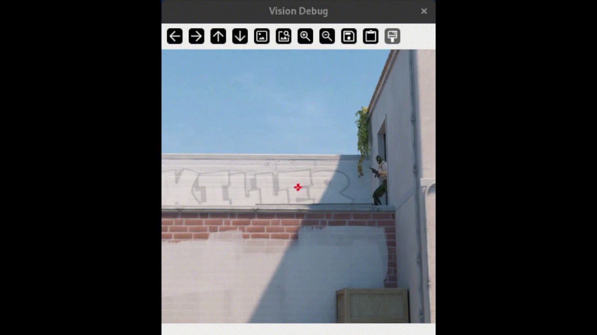

# Utruna

Data Science Engineer | Diplômé de Polytech Dijon. Je fais le pont entre la Data Science et l'ingénierie logicielle robuste.

📍 Grenoble/Isère, France · 💼 Kroschke France

---

## 🛡️ TunnelVision — Anti-cheat x-ray pour Minecraft

<!-- Remplace la ligne ci-dessous par une vraie capture/GIF une fois uploadée dans assets/ -->

  

Système de détection de triche x-ray sur serveurs Minecraft dédiés, basé sur l'analyse des logs de minage CoreProtect. Plugin Java (Bukkit/Spigot) couplé à un pipeline Python (FastAPI, Isolation Forest, rapports 3D interactifs). Architecture multi-tenant (un conteneur Docker isolé par client), en développement vers une API commerciale.

---

## 💃 DanseAvecLaStare — Plugin Minecraft (danseurs NPC animés)

<!-- Remplace par une capture/GIF du plugin en action -->

  

Plugin Paper (Java 21) qui anime des NPC danseurs 3D en temps réel via ModelEngine 4. Développé bénévolement pour La Taverne, association loi 1901, pour le festival de musique électronique TomorrowCraft. Playlists d'animations programmables, application dynamique de skins, système de permissions par rôles.

---

## 🧬 Game of Life ND — Jeu de la vie de Conway en 3D/4D

<!-- Remplace par une capture/GIF du rendu Three.js une fois disponible -->

  

Généralisation du jeu de la vie de Conway en N dimensions (3D et 4D). Moteur de simulation en Python (numpy/scipy), rendu prévu en Three.js avec slicing temporel pour visualiser la 4D. *(Projet en cours de développement.)*

---

## 🎥 Overlay Twitch — Wakfu Combo Overlay

<!-- Remplace par une capture/GIF de l'overlay en stream -->

  

Overlay Twitch affichant les sorts lancés sous forme de liste défilante, configurable par l'utilisateur final (dimensions, sens de défilement) et associant chaque sort à une classe.

---

## 🎯 Détection & suivi de cible — Vision par ordinateur (CS2)

<!-- Remplace par une capture/GIF de la détection en action -->

  

Système expérimental de détection et de suivi de cible pour Counter-Strike 2, basé sur YOLOv10. Projet développé strictement à des fins éducatives pour l'étude de la vision par ordinateur en temps réel.

---

## 🛠️ Stack

Python · Java · TypeScript · Docker · FastAPI · Three.js
